# Panduan dosen Lab 07 — BaaS, Auth, RLS, dan pgvector

**COMP6991031 sesi 07.** Kasus: Alice dan Bob menyimpan catatan dalam satu database, tetapi satu staf tidak boleh membaca atau membuat catatan atas nama staf lain. Panduan ini mendampingi [modul mahasiswa dengan kunci A–F](MODUL_MAHASISWA.md). RPS sesi 07 mencakup BaaS/Supabase, schema SQL, Auth, RLS, Storage, dan pengantar pgvector. Praktik inti di sini berjalan pada PostgreSQL lokal; proyek Supabase adalah perluasan bila akun tersedia.

| Checkpoint | Bukti visual di panduan | Kriteria pembacaan |
|---|---|---|
| Persiapan | 09, 01, Docker Desktop 00 | Config valid; db healthy; Adminer hidup. |
| Setup SQL/policy | 10, 02 | Dua role, dua baris, `USING`/`WITH CHECK`. |
| Isolasi RLS | 03, 04 | Satu baris per role; INSERT silang ditolak. |
| Web/vektor | Adminer 07/08, 05 | Owner dua baris; Docker jarak 0. |
| Challenge | 06 | 10 PASS, 0 FAIL. |
| Cloud opsional | 13 | Source `auth.uid()` terlihat; eksekusi cloud perlu proyek peserta. |
| Git/cleanup | 11, 12 | Secret diabaikan; container berhenti tanpa menghapus volume. |

## Persiapan dosen sebelum kelas

1. Pastikan Docker Engine aktif dan port `127.0.0.1:8087` kosong. Buka root repo `meet7CloudService` di PowerShell.
2. Salin `secrets/db_password.example.txt` menjadi `secrets/db_password.txt`; isi nilai latihan lokal. File hasil salinan dan `.env` diabaikan Git.
3. Jalankan `docker compose config --quiet` lalu `docker compose --profile debug up -d --wait`. Buka Chrome pada <http://127.0.0.1:8087/>. Jangan tampilkan password saat berbagi layar.
4. Jalankan `local-rls-demo.sql` dan `vector-local-demo.sql` dengan command di bawah. Checker `tests/challenge.ps1` harus mencapai 10 PASS.
5. Siapkan dua jendela: terminal untuk `SET ROLE` dan Chrome/Adminer untuk tabel owner. Kontras kedua tampilan adalah inti penjelasan RLS.

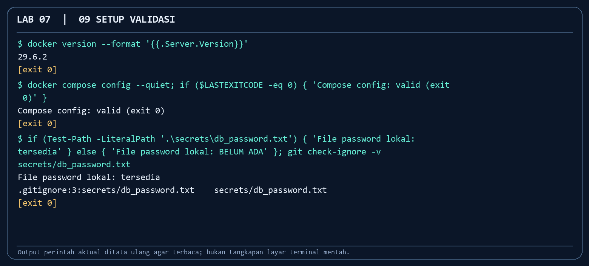

*Command:* `docker version`, `docker compose config --quiet`, `git check-ignore -v secrets/db_password.txt`. *Fungsi:* memeriksa mesin, konfigurasi, dan perlindungan file password sebelum kelas. *Cara kerja:* Docker mengembalikan versi server, Compose memvalidasi YAML, Git mencari aturan ignore. *Baca hasil:* setiap command exit 0, config valid, password diabaikan. Gambar merender [output run aktual](screenshots/09_setup_validasi.txt), bukan screenshot terminal mentah.

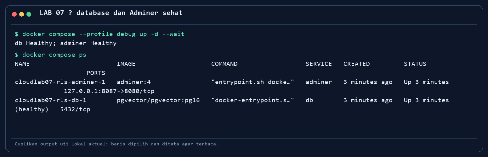

*Langkah: `docker compose --profile debug up -d --wait` lalu `docker compose ps`. Fungsi: memastikan db siap sebelum demo SQL. Cara kerja: Compose menunggu healthcheck PostgreSQL, membuat jaringan dan volume, dan hanya membuka Adminer di host 8087. Baca hasil: db Healthy, Adminer Up, port 5432 tidak dipublish.*

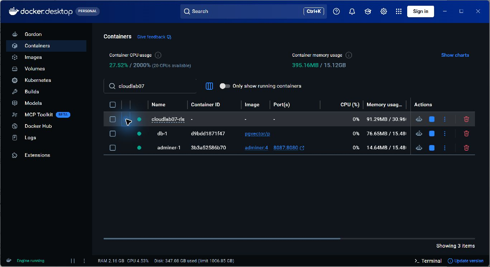

*Langkah: buka Containers di Docker Desktop dan perluas `cloudlab07-rls`. Fungsi: memperlihatkan komponen lab kepada kelas. Cara kerja: Compose mengelompokkan `db-1` dan `adminer-1`; titik hijau berarti container berjalan. Baca hasil: database memakai image `pgvector/pgvector:pg16`, Adminer memakai `adminer:4` dengan port host 8087. Jelaskan bahwa status Healthy yang lebih kuat diperiksa melalui `docker compose ps`.*

## Alokasi 100 menit yang disarankan

| Menit | Aktivitas dosen | Bukti/checkpoint mahasiswa |
|---|---|---|
| 0–10 | Ceritakan kasus kebocoran catatan antarstaf; bedakan Auth dan otorisasi. | Mahasiswa menjelaskan mengapa filter frontend saja tidak cukup. |
| 10–25 | Start Compose, bahas secret file, healthcheck, dan Adminer. | `docker compose ps` menunjukkan DB sehat. |
| 25–45 | Jalankan SQL, baca `GRANT`, `USING`, `WITH CHECK`. | Policy terpasang. |
| 45–60 | Demo SELECT Alice/Bob dan INSERT lintas pemilik yang ditolak. | Dua baris terisolasi; error RLS terkontrol. |
| 60–75 | Buka Adminer sebagai owner, bandingkan dengan `SET ROLE`. | Mahasiswa memahami owner bypass. |
| 75–85 | Jalankan pgvector mainan dan urutan jarak. | Docker paling dekat dengan query. |
| 85–100 | Jalankan checker, diskusikan kunci A–F, laporan/Git/cleanup. | 10 PASS, 0 FAIL dan bukti pribadi tersimpan. |

## Demo 1 — setup dan policy

**PowerShell dari root repo:**

```powershell
Copy-Item .\secrets\db_password.example.txt .\secrets\db_password.txt
docker compose --profile debug up -d --wait
Get-Content -Raw .\local-rls-demo.sql | docker compose exec -T db psql -v ON_ERROR_STOP=1 -U labadmin -d lab07
docker compose exec -T db psql -U labadmin -d lab07 -c "SELECT policyname, cmd, roles, qual, with_check FROM pg_policies WHERE tablename='rls_demo';"
```

Jika file password sudah ada, jangan menimpanya tanpa sengaja. Pada Bash, gunakan redirection `< local-rls-demo.sql`. `-T` diperlukan saat psql membaca pipe. Script membuat dua role dan tabel `rls_demo`, mengaktifkan RLS, memberi GRANT, memasang policy, lalu menyiapkan satu catatan per role. Demo dapat diulang; hanya tabel ini yang di-`TRUNCATE`.

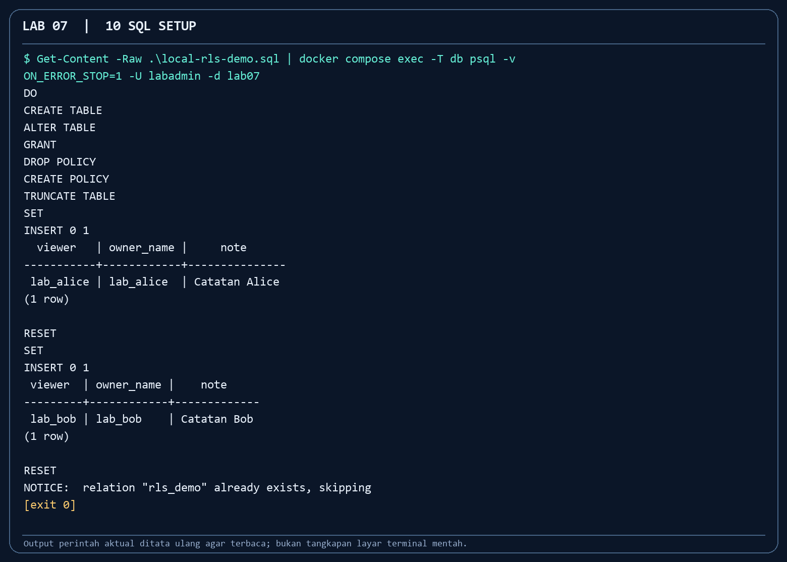

*Command:* pipe `local-rls-demo.sql` ke `docker compose exec -T db psql ...`. *Fungsi:* membuat keadaan demo yang konsisten. *Cara kerja:* psql menjalankan SQL berurutan; `ON_ERROR_STOP=1` menggagalkan command bila SQL salah. *Baca hasil:* policy dibuat dan `INSERT 0 1` muncul untuk Alice serta Bob. [Output lengkap](screenshots/10_sql_setup.txt).

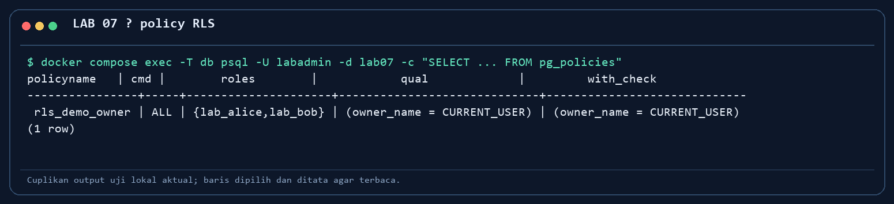

*Langkah: baca `pg_policies` setelah script. Fungsi: memeriksa aturan database, bukan hanya klaim dalam SQL file. Cara kerja: `USING` menyaring baris lama dan `WITH CHECK` memvalidasi baris baru/hasil UPDATE. Baca hasil: `owner_name = CURRENT_USER` untuk kedua role.*

**Pertanyaan cepat:** “Apakah `GRANT SELECT` otomatis membuat Alice hanya melihat barisnya?” Jawaban: tidak; GRANT bekerja pada tabel, RLS pada baris. Jika mahasiswa melihat 0 baris, cek `SET ROLE`, nilai `owner_name`, serta policy. Jika melihat 2 baris sebagai `labadmin`, itu owner bypass; lanjutkan dengan `SET ROLE`.

## Demo 2 — bukti isolasi dan penolakan

```powershell
docker compose exec -T db psql -v ON_ERROR_STOP=1 -U labadmin -d lab07 -c "SET ROLE lab_alice; SELECT current_user AS viewer, owner_name, note FROM rls_demo; RESET ROLE; SET ROLE lab_bob; SELECT current_user AS viewer, owner_name, note FROM rls_demo;"
docker compose exec -T db psql -v ON_ERROR_STOP=1 -U labadmin -d lab07 -c "SET ROLE lab_bob; INSERT INTO rls_demo (owner_name,note) VALUES ('lab_alice','Percobaan silang');"
```

Command kedua **harus gagal** dengan pesan `new row violates row-level security policy`. Jangan mengubah policy agar tes merah itu “lulus”; kesalahan tersebut adalah bukti keamanan yang diminta. Bedakan kegagalan terencana ini dari masalah instalasi.

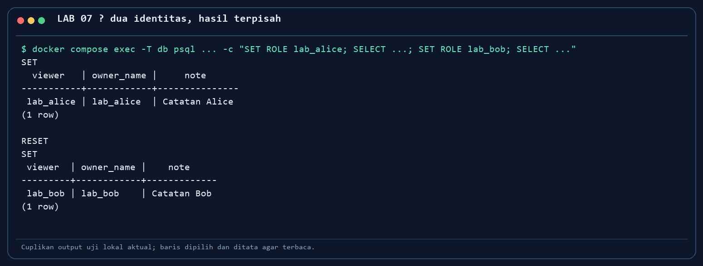

*Langkah: `SET ROLE` Alice dan Bob sebelum SELECT. Fungsi: menunjukkan otorisasi di database. Cara kerja: policy memfilter hasil untuk `current_user`. Baca hasil: masing-masing tepat satu catatan miliknya.*

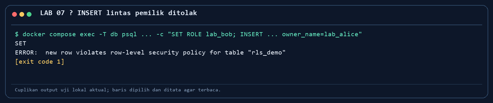

*Langkah: `SET ROLE lab_bob` lalu INSERT dengan `owner_name='lab_alice'`. Fungsi: menguji `WITH CHECK`. Cara kerja: PostgreSQL menolak baris yang tidak memenuhi policy. Baca hasil: error RLS dan exit code bukan nol; jumlah baris tetap dua.*

## Demo 3 — Adminer dan pgvector

Di Adminer, pilih PostgreSQL/server `db`/user `labadmin`/database `lab07`, lalu tabel `rls_demo`. Owner tabel melihat kedua baris. Mintalah mahasiswa membandingkan identitas login Adminer dengan `viewer` pada terminal. Jangan gunakan UI owner sebagai satu-satunya bukti RLS.

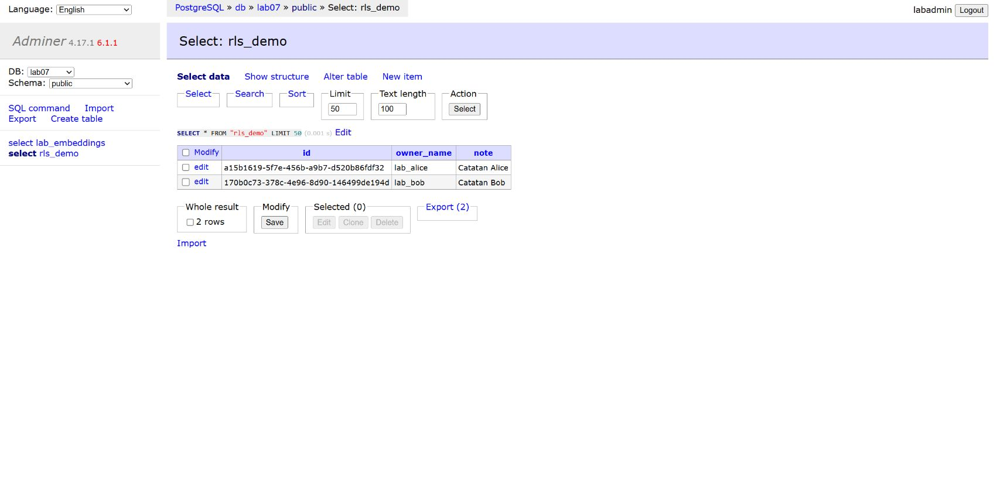

*Langkah: buka `127.0.0.1:8087` dan klik `select rls_demo`. Fungsi: memperlihatkan data nyata di web. Cara kerja: Adminer mengakses PostgreSQL melalui jaringan Compose sebagai owner. Baca hasil: dua baris terlihat; hasil ini konsisten dengan query role yang masing-masing satu baris.*

```powershell
Get-Content -Raw .\vector-local-demo.sql | docker compose exec -T db psql -v ON_ERROR_STOP=1 -U labadmin -d lab07
```

File ini mengaktifkan pgvector, membuat tiga vektor mainan, lalu mengurutkan jarak ke `[1,0,0]`. Kaitkan operator `<->` dengan gagasan pencarian top-K yang akan muncul lagi pada Lab 11. Jangan menyebut tiga angka buatan itu sebagai embedding model.

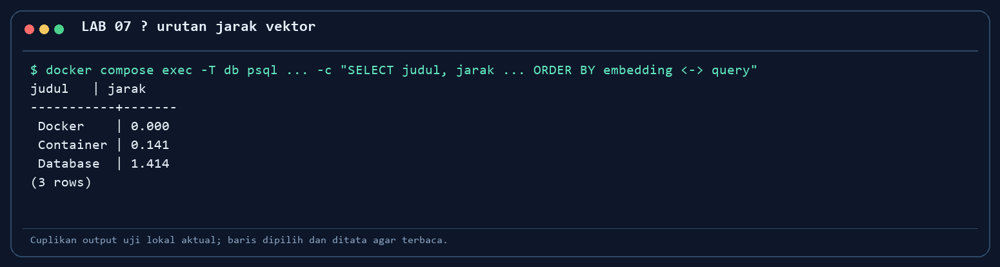

*Langkah: jalankan script vektor. Fungsi: melihat nearest neighbor sederhana. Cara kerja: `<->` menghitung jarak Euclidean dan `ORDER BY` mengurutkan. Baca hasil: Docker 0, Container sekitar 0,141, Database sekitar 1,414.*

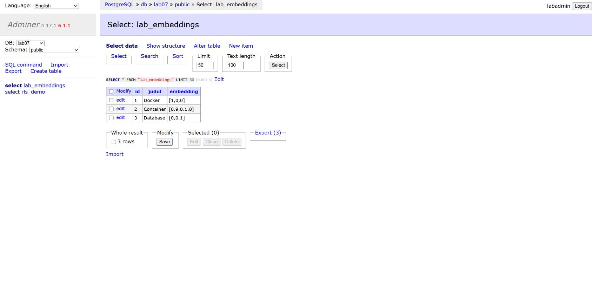

*Langkah: klik `select lab_embeddings`. Fungsi: mengaitkan hasil query dengan tabel. Cara kerja: Adminer membaca nilai `vector(3)` sebagai teks. Baca hasil: tiga baris ada; kemiripan tidak dibuktikan oleh urutan default tabel.*

## Kunci challenge A–F untuk diskusi

| Bagian | Kunci |
|---|---|
| A | `up -d --wait` menunggu healthcheck; `ps` menunjukkan database Healthy. |
| B | GRANT membuka operasi tabel, RLS menyaring baris; keduanya perlu. |
| C | `labadmin` adalah owner dan dapat melihat dua baris; `SET ROLE lab_alice/bob` masing-masing melihat satu. |
| D | `USING` mengatur baris lama, `WITH CHECK` baris baru; INSERT silang ditolak. |
| E | Docker paling dekat dengan `[1,0,0]`. Vektor tiga dimensi ini contoh numerik, bukan model ML. |
| F | Lokal memakai `current_user`; Supabase memakai JWT + `auth.uid()`. Secret/service role key tidak boleh di browser. |

**Verifikasi:** `& .\tests\challenge.ps1` di PowerShell atau `bash tests/challenge.sh` di Git Bash/Linux. Dua skrip diuji di laptop dosen dan menghasilkan **10 PASS, 0 FAIL**.

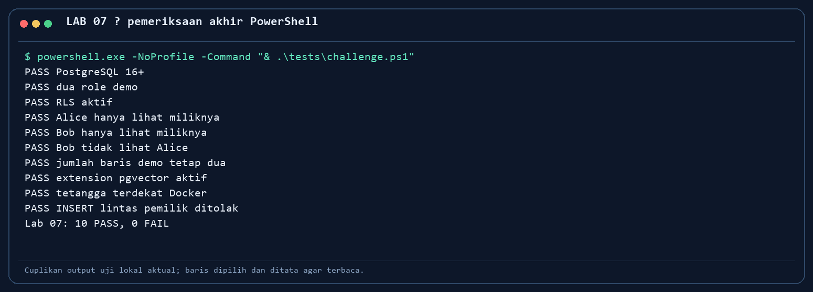

*Langkah: jalankan checker. Fungsi: mengulang bukti role, policy, vector, dan penolakan. Cara kerja: skrip memanggil psql dan menganggap error INSERT silang sebagai PASS. Baca hasil: 10 PASS, 0 FAIL.*

## Supabase, penilaian, dan Git

Pada jalur cloud, `schema.sql` harus dijalankan di **Supabase SQL Editor** karena memakai `auth.users` dan `auth.uid()`; file itu tidak sesuai untuk database Compose lokal. Minta mahasiswa memakai dua akun latihan, publishable key, dan `.env` lokal. Storage bucket private saja belum memberi akses aplikasi tanpa policy. Bila akun/kuota tidak tersedia, nilai capaian inti dari jalur lokal dan diskusi desain Supabase.

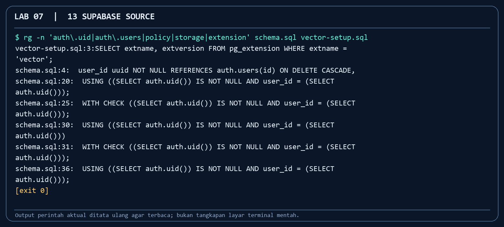

*Command:* `rg -n 'auth\.uid|auth\.users|policy|storage|extension' schema.sql vector-setup.sql`. *Fungsi:* menunjukkan transisi dari `current_user` lokal ke identitas JWT di Supabase. *Cara kerja:* hanya membaca file, belum menjalankan SQL cloud. *Baca hasil:* referensi `auth.users` dan syarat `auth.uid()` tampak. [Output lengkap](screenshots/13_supabase_source.txt).

Tidak ada screenshot hasil Supabase dalam paket ini: jalur cloud belum dijalankan pada proyek peserta. Bila memilih jalur tambahan, minta bukti SQL Editor, Auth dua akun yang identitasnya disamarkan, dan hasil uji policy dari proyek peserta sendiri.

Laporan yang baik berisi fungsi tiap command, SELECT terpisah, error INSERT yang diharapkan, screenshot Adminer dengan penjelasan owner, urutan vektor, dan refleksi bagaimana database mencegah kebocoran bila frontend salah. Mahasiswa membuat repo pribadi dari template, memeriksa `git status` dan `git diff --cached --name-only`, lalu push laporan serta screenshot **milik sendiri**. Pastikan `.env` dan `secrets/db_password.txt` tidak staged.

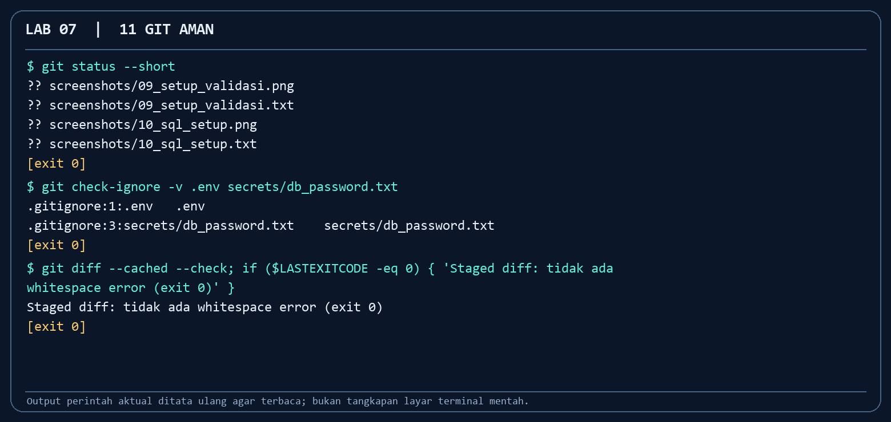

*Command:* `git status --short`, `git check-ignore -v .env secrets/db_password.txt`, `git diff --cached --check`. *Fungsi:* mendeteksi perubahan dan mencegah secret ikut commit. *Cara kerja:* status menampilkan file baru; ignore menampilkan aturan yang cocok; diff check memeriksa staged diff. *Baca hasil:* aturan untuk `.env` dan file password ditemukan. Dalam cuplikan ini belum ada file staged, jadi minta mahasiswa mengulang diff check **setelah** `git add` dan menunjukkan push repo sendiri. [Output lengkap](screenshots/11_git_aman.txt).

Sesudah kelas, jalankan `docker compose --profile debug down`. Volume tetap ada; jangan gunakan `-v` bila data hendak dipakai lagi.

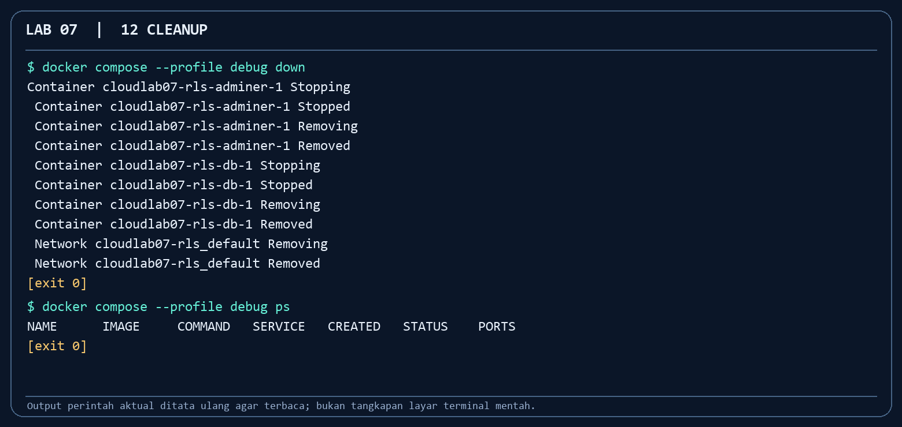

*Command:* `docker compose --profile debug down` lalu `docker compose --profile debug ps`. *Fungsi:* menutup demo dengan rapi. *Cara kerja:* Compose menghapus container dan jaringan tetapi mempertahankan volume. *Baca hasil:* `ps` kosong. Uji restart pada mesin dosen membuktikan dua catatan dan tiga vektor masih tersimpan. [Output lengkap](screenshots/12_cleanup.txt).

## Diagnosis cepat

| Gejala | Arahkan mahasiswa |
|---|---|
| `Cannot connect to Docker daemon` | Buka Docker Desktop hingga Engine running; ulangi `docker version`. |
| Password secret tidak ada | Salin contoh ke `secrets/db_password.txt`, jangan commit. |
| Port 8087 dipakai | Periksa `docker ps` dan pemilik port; jangan hentikan service yang bukan lab. |
| `auth.users` tidak ada | Mereka menjalankan SQL Supabase pada PostgreSQL lokal; gunakan `local-rls-demo.sql`. |
| Adminer dua baris | Jelaskan owner bypass, ulangi SELECT memakai `SET ROLE`. |
| Checker vector gagal | Jalankan `vector-local-demo.sql`; cek extension `vector`. |

Rujukan: [Supabase RLS](https://supabase.com/docs/guides/database/postgres/row-level-security), [Supabase vector columns](https://supabase.com/docs/guides/ai/vector-columns), [pgvector](https://github.com/pgvector/pgvector).
